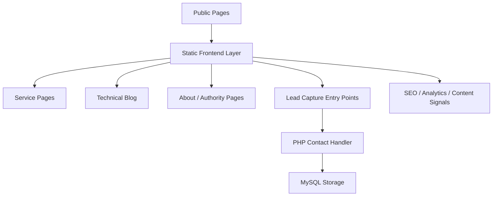

# HydroAbyss Public Showcase

HydroAbyss is a maritime technology and technical publishing platform focused on maritime operations, STCW, compliance, technical diagnostics, and specialised service delivery.

Live site: [hydroabyss.com](https://hydroabyss.com)

## Selected public pages

- Home: [hydroabyss.com](https://hydroabyss.com)
- Services hub: [hydroabyss.com/servicios/](https://hydroabyss.com/servicios/)
- Technical diagnosis: [hydroabyss.com/diagnostico-tecnico/](https://hydroabyss.com/diagnostico-tecnico/)
- Founder profile: [hydroabyss.com/sobre/robert-garaban/](https://hydroabyss.com/sobre/robert-garaban/)
- Blog index: [hydroabyss.com/blog/](https://hydroabyss.com/blog/)
- Sample article: [hydroabyss.com/blog/trabajar-en-el-mar-antes-de-pagar-curso-nautico/](https://hydroabyss.com/blog/trabajar-en-el-mar-antes-de-pagar-curso-nautico/)

## Why this repository exists

The production repository for HydroAbyss stays private.

This public repository is the controlled showcase version:

- enough to demonstrate the product and technical direction
- without exposing the full production source tree
- without exposing operational workflows, raw assets, deployment internals, or sensitive business context

If a recruiter, technical lead, or serious collaborator wants to review the full implementation, access can be granted separately on request.

## What this public showcase includes

- product overview
- technical architecture snapshot
- selected implementation notes
- public-facing structure and feature summary
- evaluation access policy

## What stays private

- production deployment scripts
- internal operations and marketing playbooks
- admin workflows and backend internals
- raw source material and working originals
- infrastructure details beyond high-level architecture

## Product snapshot

HydroAbyss combines:

- maritime technical publishing
- service pages for diagnostics and maritime support
- multilingual public content
- contact capture and business inquiry flows
- authority-building content around STCW, maritime operations, and naval engineering

## Why it matters

This is not just a brochure website.

HydroAbyss is a business-facing platform designed to:

- build authority in a specialised maritime niche
- attract qualified leads through technical content and service pages
- connect operational expertise with discovery, trust, and conversion
- support long-form content, multilingual structure, and commercial navigation without unnecessary frontend complexity

## Technical snapshot

- Frontend: `HTML5`, `CSS3`, `Vanilla JavaScript`
- Backend: `PHP`
- Database: `MySQL`
- Content model: static routes + structured articles + service hubs
- Focus areas: performance, SEO, information architecture, multilingual content, business conversion

## Selected capabilities

- service-led information architecture instead of a generic brochure site
- technical content production for maritime and regulatory topics
- commercial pages designed around real maritime workflows
- lightweight frontend with minimal dependency surface
- backend contact flow separated from the public content layer

## Public evaluation guide

If you are reviewing this project, the fastest way to evaluate it is:

1. Visit the public site and scan the home, services, and founder pages.
2. Check how technical content supports service discovery and authority.
3. Review the architecture summary in [docs/architecture.md](./docs/architecture.md).
4. Use this repository as the portfolio layer, not as the full production source.

## Architecture overview

## Repository strategy

This repository is intentionally not the full source repository.

It is a public portfolio layer. The source-of-truth implementation remains private and can be shared selectively for:

- hiring review
- due diligence
- technical collaboration
- partnership conversations

## Project status

Current status: `ready to show as portfolio`.

That means:

- the live product exists
- the private production repo exists separately
- this public repository is already suitable to share with recruiters, CTOs, and collaborators
- deeper source review is available by request, not by default

## Review access

If you want deeper review access, open an issue or contact me through:

- GitHub: [Robertgaraban](https://github.com/Robertgaraban)
- LinkedIn: [linkedin.com/in/robertgaraban](https://www.linkedin.com/in/robertgaraban)
- Website: [hydroabyss.com](https://hydroabyss.com)

## Código fuente

**Repositorio privado:** `Robertgaraban/hydroabyss` — acceso como colaborador bajo solicitud

Solicitar acceso: **robertgaraban@gmail.com** — Asunto: `[Acceso repo privado] hydroabyss`

## Notes

- This repository is published for evaluation and portfolio review.
- It is not intended as an open-source release of the full production system.
- See [docs/public-scope.md](./docs/public-scope.md), [docs/closeout.md](./docs/closeout.md), and [NOTICE.md](./NOTICE.md).
